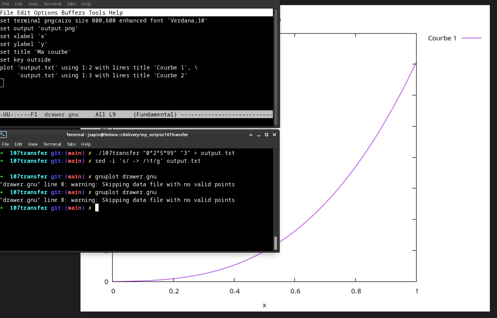

# __Optimization of Transfer Function Computations__

## Français

   Un laboratoire effectue des tests sur de nouveaux composants électroniques à intégrer dans sa dernière génération de chipset. Ces composants sont entièrement caractérisés par leur fonction de transfert, qui détermine la réponse en fréquence ; cette fonction traite la fréquence d'entrée et calcule une fréquence de sortie (caractérisant la façon dont le composant amplifie ou réduit la fréquence d'entrée). Les fonctions de transfert de ces composants sont des fonctions rationnelles, c'est-à-dire des fractions dont le numérateur et le dénominateur sont des polynômes :

   Le sujet de mathématiques concerne l'optimisation du calcul de fonctions de transfert rationnelles pour des composants électroniques. Les fonctions de transfert sont définies par des polynômes pour le numérateur et le dénominateur, et sont utilisées pour déterminer la réponse en fréquence d'un composant électronique. Le programme à développer doit gérer plusieurs composants en cascade et imprimer les réponses en fréquence pour une plage de valeurs données. La précision des nombres en virgule flottante doit être prise en compte pour éviter toute erreur de calcul.

Votre programme doit imprimer les réponses en fréquence du composant pour toutes les valeurs dans une plage de 0 à 1, avec un pas de 0,001.

Vous devez utiliser un algorithme rapide, les programmes lents seront considérés comme non fonctionnels...

Attention à la précision lors de l'utilisation de nombres à virgule flottante !

   L'algorithme de __Horner__ permet d'évaluer un polynôme de manière optimisée en réduisant le nombre de multiplications nécessaires. Ici, la fonction evaluate_polynomial utilise l'algorithme de Horner pour calculer la valeur d'un polynôme donné à un certain point x. Cette optimisation permet de réduire le nombre de multiplications nécessaires pour évaluer le polynôme.

Voici un exemple d'utilisation : 

(la première fenêtre étant le fichier _drawer.gnu_ )

## English

   A laboratory performs tests on new electronic components to be integrated into its last generation chipset. Those components are entirely characterized by their transfer function, which determines frequency response; this function processes the input frequency and computes an output frequency (characterizing the way the component amplifies or reduces the input frequency). The transfer functions of these components are rational functions, i.e. fractions such as both the numerator and the denominator are polynomials:

   The math topic concerns the optimization of the computation of rational transfer functions for electronic components. The transfer functions are defined by polynomials for the numerator and denominator and are used to determine the frequency response of an electronic component. The program to be developed must handle multiple components in cascade and print the frequency responses for a given range of values. Floating-point number precision must be taken into account to avoid calculation errors.

Your program has to print the frequency responses of the component for a every values in a range from 0 to 1, with a step of 0.001.

You should use a fast algorithm, slow programs will be considered non functional. . .

Beware of precision when using floating-point numbers!

   __Horner's__ algorithm enables optimized polynomial evaluation by reducing the number of required multiplications. The function 'evaluate_polynomial' in this project utilizes Horner's algorithm to compute the value of a given polynomial at a specific point x. This optimization significantly reduces the number of required multiplications to evaluate the polynomial efficiently.

Here is an example :

It is possible to visualize the resulting curve of the output using gnuplot:
(I used a "drawer.gnu" file to parameterize gnuplot so that it directly uses the output of my program.)

